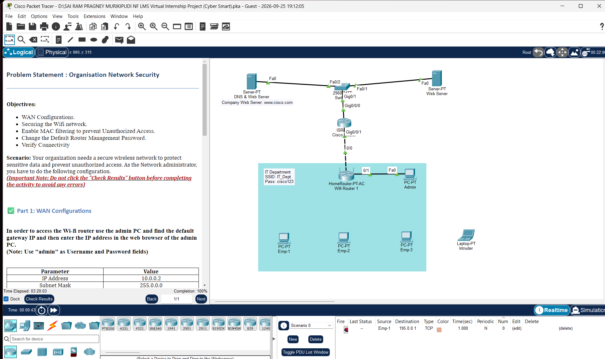

# NIIT + Cisco Cybersecurity Internship Packet Tracer Project

A collection of networking and cybersecurity activities completed during the **NIIT Foundation + Cisco Cybersecurity Internship** using **Cisco Packet Tracer**.

## Overview

This repository documents practical cybersecurity and networking work completed during the internship, with a focus on configuring and securing network infrastructure using Cisco Packet Tracer.

The activities covered wireless network security, WAN configuration, access control, router administration, and network connectivity verification.

## Project: Organisation Network Security

One of the main activities involved securing an organization's wireless network against unauthorized access.

### Network Topology



## Objectives

* Configure WAN settings
* Configure a secure wireless network
* Configure WPA2-Personal wireless security
* Enable AES encryption
* Configure MAC address filtering
* Permit authorized employee devices
* Prevent unauthorized wireless access
* Change the default router management password
* Verify network connectivity

## Configuration

### WAN Configuration

The wireless router was configured with the required WAN parameters:

| Parameter       | Configuration |
| --------------- | ------------- |
| IP Address      | `10.0.0.2`    |
| Subnet Mask     | `255.0.0.0`   |
| Default Gateway | `10.0.0.1`    |
| DNS Server      | `195.0.0.1`   |

### Wireless Network

| Parameter     | Configuration   |
| ------------- | --------------- |
| Wireless Band | `2.4 GHz`       |
| SSID          | `IT_Dept`       |
| Security Type | `WPA2-Personal` |
| Encryption    | `AES`           |

> Wireless credentials are intentionally not included in this README.

### MAC Address Filtering

MAC address filtering was enabled on the wireless router to allow only authorized employee devices to connect to the wireless network.

This configuration was used to prevent the unauthorized device from accessing the network.

### Router Administration

The default router management password was changed as part of the security configuration.

The actual administrator password is intentionally not included in this public repository.

## Verification

The network configuration was verified by:

* Connecting authorized employee devices to the wireless network
* Confirming wireless connectivity for authorized devices
* Verifying that the unauthorized device could not access the wireless network
* Testing connectivity from an employee workstation
* Accessing `www.cisco.com` through the workstation's web browser

The Organisation Network Security activity was successfully completed with **100% completion**.

## Technologies & Concepts

* **Cisco Packet Tracer**
* Wireless Networking
* WAN Configuration
* WPA2-Personal
* AES Encryption
* MAC Address Filtering
* Network Access Control
* Router Administration
* Network Connectivity Testing

## Project File

The Cisco Packet Tracer activity file is included in this repository:

`Organisation-Network-Security.pka`

The `.pka` file contains the network topology and configurations used for the activity.

## Internship

**Program:** NIIT Foundation + Cisco Cybersecurity Internship
**Focus:** Networking and Cybersecurity
**Platform:** Cisco Packet Tracer

## Repository Contents

```text
niit-cisco-cybersecurity-internship-packet-tracer-project/
│
├── README.md
├── Organisation-Network-Security.pka
└── packet-tracer-topology.png
```

## Disclaimer

This repository contains practical work completed as part of the NIIT Foundation + Cisco Cybersecurity Internship and is intended to document the networking and cybersecurity concepts practiced during the program.
